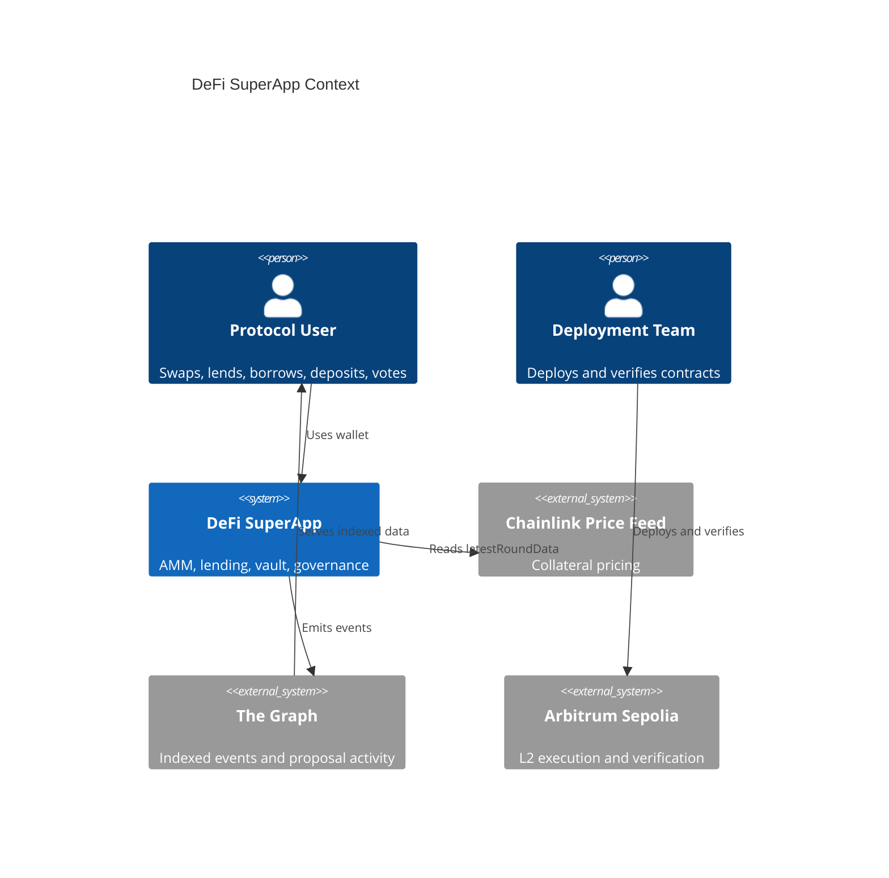
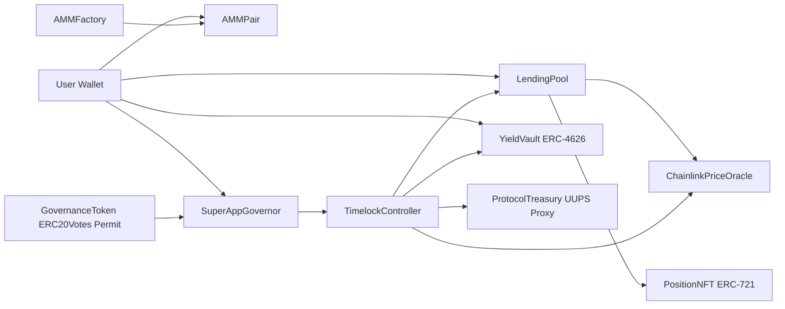
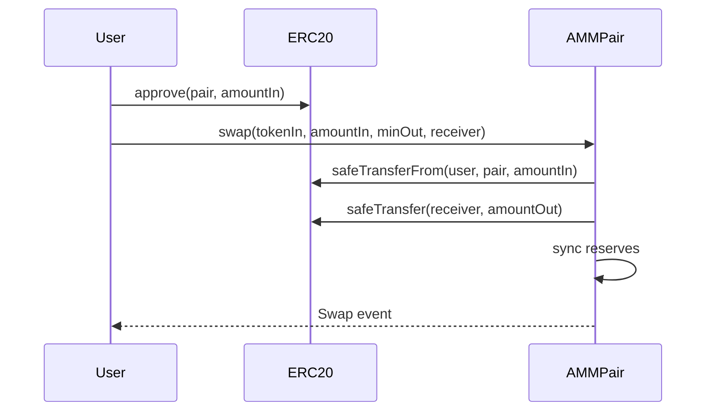
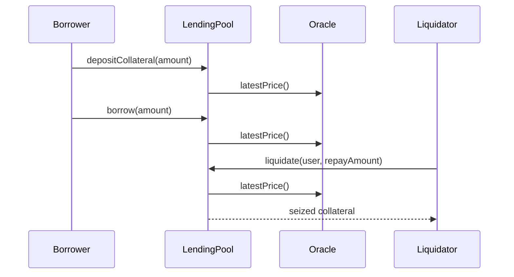
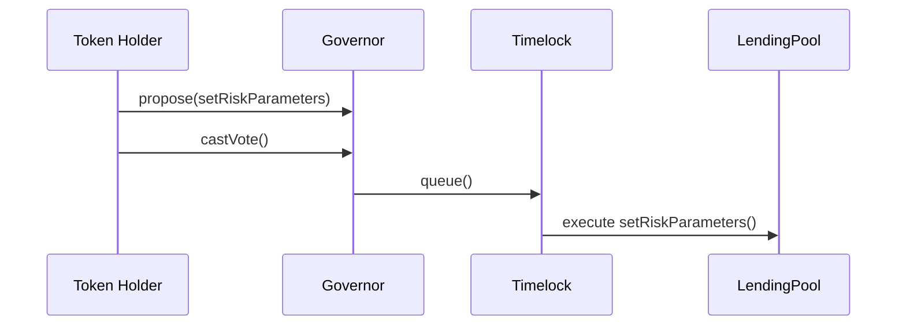

# Architecture

## System Context

## Contract Components

## Critical Flows

### Swap

### Borrow and Liquidate

### Governance Execution

## Storage Layout Notes

Upgradeable storage is limited to `ProtocolTreasuryV1`.

| Slot Owner                                                    | Variables                                              |
| ------------------------------------------------------------- | ------------------------------------------------------ |
| OpenZeppelin Initializable/UUPS/AccessControl/ReentrancyGuard | inherited storage                                      |
| `ProtocolTreasuryV1`                                          | no custom mutable state except inherited role mappings |
| Gap                                                           | `uint256[49] private __gap`                            |
| `ProtocolTreasuryV2`                                          | no new storage                                         |

Because V2 adds only a function and no storage variables, no storage collision is introduced.

## Design Patterns

| Pattern                     | Location                                 | Justification                                                |
| --------------------------- | ---------------------------------------- | ------------------------------------------------------------ |
| Factory                     | `AMMFactory`                             | Permissionless pair creation and deterministic addresses     |
| UUPS Proxy                  | `ProtocolTreasuryV1/V2`                  | Treasury can be upgraded only through timelock authorization |
| Checks-Effects-Interactions | AMM, lending, treasury                   | State is updated before risky value release where practical  |
| Access Control              | Oracle, lending, vault, treasury, tokens | Privileged operations are role-gated                         |
| Pausable                    | AMM, lending, vault                      | Emergency stop for user-facing state transitions             |
| Oracle Adapter              | `ChainlinkPriceOracle`                   | Isolates stale-price and decimal normalization logic         |
| Timelock                    | Governor stack                           | Adds a 2-day delay before privileged execution               |
| Reentrancy Guard            | AMM, lending, vault, treasury            | Guards external token and ETH transfer paths                 |

## Trust Assumptions

The Timelock is the long-term administrator for the treasury and protocol parameters. If the timelock proposer path is compromised, malicious proposals can be queued but remain visible during the delay. If a token whale controls quorum, governance can pass harmful proposals; the mitigation is quorum, proposal threshold, voting delay, and the public timelock delay.

## ADR Log

### ADR-001: Hardhat First

Context: Foundry is not installed in the workspace.

Options: wait for Foundry installation, or implement with Hardhat.

Decision: use Hardhat for the first executable implementation.

Consequences: contracts and tests run locally now; Foundry-specific fuzz/invariant tests must be added if required by the instructor.

### ADR-002: Single Collateral Lending Pool

Context: Option A requires lending but not a full multi-asset money market.

Options: multi-collateral architecture or focused single-collateral pool.

Decision: implement one collateral asset and one borrow asset with a Chainlink-style price feed.

Consequences: the risk model is auditable for the capstone and can be generalized later.
